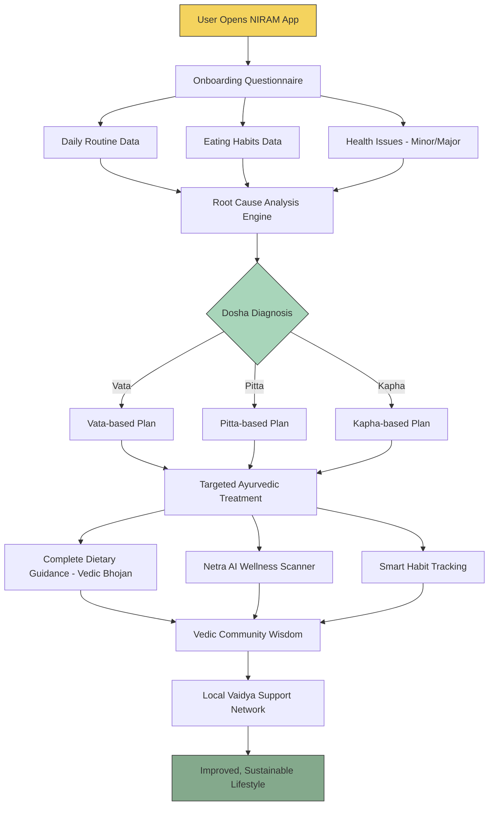

# 🌿 NIRAM — Vedic Intelligence & Health Dashboard

**Ancient Wisdom. Smart Fitness. Better Wellness.**

> NIRAM is not another "readymade remedy" app. It listens to your body first, diagnoses the *root cause* using Ayurveda, and only then prescribes a natural, personalized path back to health.

---

## 📖 Table of Contents

- [Overview](#-overview)
- [The Problem](#-the-problem)
- [Our Inspiration](#-our-inspiration)
- [How It Works](#️-how-it-works)
- [System Flow Diagram](#-system-flow-diagram)
- [Core Modules](#-core-modules)
- [Modern Fitness Challenges We Address](#-modern-fitness-challenges-we-address)
- [Features](#-features)
- [Advantages](#-advantages)
- [Our References](#-our-references)
- [Vision](#-vision)
- [Disclaimer](#️-disclaimer)
- [Contributing](#-contributing)

---

## 🕉️ Overview

**NIRAM** (also referred to internally as *Niram Studio*) is a Vedic Intelligence & Health Dashboard that blends **classical Ayurvedic diagnosis** with **modern AI-driven tools** to help people fix unstable, unmanaged, and unhealthy lifestyles.

Instead of pushing generic diet charts or one-size-fits-all workout plans, NIRAM:

1. Studies **your** daily routine, eating habits, and health complaints.
2. Diagnoses your **Dosha Prakriti** (Vata / Pitta / Kapha body nature).
3. Traces the **root cause** of the problem — not just the symptom.
4. Delivers a **personalized Ayurvedic treatment and lifestyle plan**.

It's built for two very different audiences at once — Gen Z (through animations, visuals, and interactive AI scanners) and the older generation (through classical explanation videos and familiar local herb names) — closing the credibility gap Ayurveda has faced for decades.

---

## ❗ The Problem

- A huge share of people today suffer from lifestyle diseases caused by poor eating habits, sedentary routines, and stress.
- Ayurveda has long been dismissed as "unscientific" or "quacky" — largely due to Western propaganda and poor communication by early promoters.
- Existing wellness apps give **generic, pre-packaged remedies** that ignore individual body nature.
- Many uneducated and illiterate people suffer or die every year from **wrong medicine use**, caused by unclear prescriptions or fake practitioners.
- Certified, trustworthy, and easy-to-understand Ayurvedic guidance is hard to find in one place.

---

## 💡 Our Inspiration

The founder's own journey — struggling with **obesity caused by unhealthy food and poor lifestyle** — led to discovering the teachings of **Rajeev Dixit Ji**, a social worker and speaker known for his "Aatm-Nirbhar Bharat" (self-reliant India) philosophy.

He worked closely with many **Vaidyas** (Ayurvedic doctors) throughout his life, sharing simple, free Ayurvedic treatments rooted in classical texts. Following these basic daily Ayurvedic routines brought real, measurable improvement — and that personal transformation became the seed for NIRAM.

---

## ⚙️ How It Works

Unlike typical Ayurveda or "healthy lifestyle" apps, **NIRAM does not hand you a readymade remedy.**

1. **Onboarding Questions** — The app asks about eating habits, daily routine, sleep, stress, and any minor or major health issues.
2. **Root Cause Analysis** — Using this data, the app identifies the *actual* lifestyle-driven cause of the issue, mapped against your body nature (**Vata, Pitta, Kapha**).
3. **Personalized Ayurvedic Solution** — Based on the diagnosis, NIRAM suggests natural remedies to cure the root issue and gradually improve lifestyle.
4. **Complete Dietary Guidance** — What to eat, when to eat, and what to avoid — all in one place (**Vedic Bhojan** nutrition guidance).
5. **AI Wellness Scanning** — The **Netra AI** module acts as a smart visual/health scanner to support ongoing tracking.
6. **Habit Tracking** — Smart, continuous tracking of daily routines to keep the user consistent.
7. **Community & Local Support** — Access to **Vedic Community Wisdom** and **local Vaidya support**, connecting users with self-reliant (*Aatmanirbhar*) traditional healers instead of only big pharma.

For **Gen Z**: animations, virtual imagery, and interactive videos make ancient Ayurveda approachable.
For **older generations**: classical explanation videos and familiar local herb/sherb terminology make the right treatment easy to identify.

---

## 🔄 System Flow Diagram

---

## 🧩 Core Modules

| Module | Purpose |
|---|---|
| **Data Gathering** | Collects daily routine and problem-specific data — no readymade solutions handed out upfront. |
| **Root Cause Analysis (Dosha Diagnosis)** | Identifies body nature and diagnoses the root cause through Ayurvedic principles. |
| **Targeted Treatment** | Delivers a personalized Ayurvedic care and treatment plan. |
| **Complete Dietary Guidance (Vedic Bhojan)** | Ongoing lifestyle and diet/nutrition management. |
| **Netra AI Wellness Scanner** | AI-assisted visual/wellness scanning for continuous insight. |
| **Vedic Community Wisdom** | Community-driven holistic health support rooted in Vedic teachings. |
| **Local Vaidya Support** | Connects users to Aatmanirbhar (self-reliant) local traditional healers. |
| **Smart Habit Tracking** | Tracks daily habits and routine adherence over time. |

---

## 🏋️ Modern Fitness Challenges We Address

1. **Urban Sedentary Syndrome** — Extreme inactivity from desk jobs, screen time, and commuting causing systemic decay.
2. **Body Image Obsession** — Mental stress driven by unrealistic social-media fitness ideals and extreme perfectionism.
3. **Tech-Driven Inactivity** — Monitoring health with smart devices without actually acting on the data.
4. **Extreme Pre-Workout Overload** — Dependence on high-caffeine, stimulant-heavy supplements risking heart strain.
5. **Unregulated Online Coaching** — Following non-certified generic programs, leading to poor progress and injury risk.
6. **Competitive Fitness Pressure** — Stress from conforming to ultra-intense fitness culture, causing burnout.

---

## ✨ Features

- ✅ Simple, intuitive to use
- 🍛 Personalized Diet & Nutrition guidance
- 🆓 Free to use
- 📊 Fiber Chart tracking
- 🇮🇳 Bhartiya (Indian) Foods focus
- 🧬 Dosha Prakriti assessment (Vata / Pitta / Kapha)
- 👁️ Netra AI wellness scanner
- 📆 Smart habit tracking dashboard
- 🎥 Dual-format content: animated explainers for Gen Z + classical videos for older users
- 🌱 Root-cause-first approach, not symptom suppression

---

## 🌟 Advantages

1. **Detoxification through root-cause identification** — treats the cause, not just the symptom.
2. **Self-awareness first** — no one understands your body better than you; NIRAM helps you correct small unhealthy habits yourself.
3. **Nature over synthetics** — just as soil, sunlight, and oxygen are nature's free gifts, Ayurvedic remedies are natural, low-cost, and side-effect-conscious.
4. **Supports "Vishwaguru Bharat"** — positions India's ancient knowledge system on a modern, global stage.
5. **Empowers local economy** — supports local Vaidyas and farmers instead of large foreign pharmaceutical companies.

---

## 📚 Our References

- **Ayurveda** — foundational system of natural medicine
- **चरक संहिता (Charak Samhita)** — classical Ayurvedic treatise
- **अष्टांगहृदयम् (Ashtang Hridayam)** — classical Ayurvedic compendium
- Teachings and public work of **Rajeev Dixit Ji**

---

## 🔭 Vision

NIRAM aims to bridge the gap between ancient Vedic knowledge and modern Gen Z sensibilities — making Ayurveda scientific, accessible, trustworthy, and free (or near-free) for everyone, while uplifting India's local Vaidya and farming communities in line with the *Aatmanirbhar Bharat* spirit.

---

## ⚠️ Disclaimer

NIRAM does **not** claim to cure serious or extreme medical conditions. It is designed for **prevention, detoxification, and lifestyle correction** only. Users should always consult a qualified doctor or nutritionist for serious health concerns. The app avoids fake or unverified medical claims and prioritizes clear, honest guidance.

---

## 🤝 Contributing

Contributions, issue reports, and feature suggestions are welcome! Please open an issue or submit a pull request to help improve NIRAM.

---

